# Diagram podróży użytkownika - HomeBudget OCR

## Wprowadzenie

Ten diagram przedstawia kompletną podróż użytkownika w aplikacji HomeBudget OCR, od rejestracji/logowania, przez przetwarzanie paragonów, aż po zarządzanie produktami.

## Podróż użytkownika

```mermaid
stateDiagram-v2
    [*] --> StronaStartowa
    
    StronaStartowa: Strona startowa
    note right of StronaStartowa
        Użytkownik wchodzi do aplikacji
        Middleware sprawdza sesję
    end note
    
    state sprawdzenie_sesji <<choice>>
    StronaStartowa --> sprawdzenie_sesji
    sprawdzenie_sesji --> Dashboard: Zalogowany
    sprawdzenie_sesji --> StronaLogowania: Niezalogowany
    
    state "Proces Autentykacji" as Auth {
        [*] --> StronaLogowania
        
        StronaLogowania: Formularz logowania
        note right of StronaLogowania
            Pola: email, hasło
            Linki: Rejestracja, Reset hasła
        end note
        
        state czy_ma_konto <<choice>>
        StronaLogowania --> czy_ma_konto
        czy_ma_konto --> FormularzRejestracji: Nie mam konta
        czy_ma_konto --> FormularzResetuHasla: Zapomniałem hasła
        czy_ma_konto --> ProbaLogowania: Wypełniono formularz
        
        FormularzRejestracji: Formularz rejestracji
        note right of FormularzRejestracji
            Pola: email, hasło, potwierdzenie
            Walidacja client-side (Zod)
        end note
        
        FormularzRejestracji --> WyslanieRejestracji: Wyślij formularz
        WyslanieRejestracji --> WalidacjaDanychRejestracji
        
        state walidacja_rejestracji <<choice>>
        WalidacjaDanychRejestracji --> walidacja_rejestracji
        walidacja_rejestracji --> TworzenieKonta: Dane poprawne
        walidacja_rejestracji --> FormularzRejestracji: Błąd walidacji
        
        TworzenieKonta: Utworzenie konta w Supabase
        state wynik_rejestracji <<choice>>
        TworzenieKonta --> wynik_rejestracji
        wynik_rejestracji --> AutoLogowanie: Sukces
        wynik_rejestracji --> FormularzRejestracji: Email zajęty
        
        AutoLogowanie: Automatyczne logowanie
        AutoLogowanie --> Dashboard
        
        ProbaLogowania: Wysłanie danych logowania
        state wynik_logowania <<choice>>
        ProbaLogowania --> wynik_logowania
        wynik_logowania --> Dashboard: Dane poprawne
        wynik_logowania --> StronaLogowania: Błędne dane
        
        FormularzResetuHasla: Reset hasła krok 1
        note right of FormularzResetuHasla
            Pole: email
            Action: request
        end note
        
        FormularzResetuHasla --> WyslanieLinku: Wyślij link
        WyslanieLinku --> KomunikatWyslano
        KomunikatWyslano: Komunikat o wysłaniu linku
        note right of KomunikatWyslano
            Nie ujawniamy czy email istnieje
        end note
        
        KomunikatWyslano --> StronaLogowania: Powrót
        
        state "Reset hasła email" as ResetEmail {
            [*] --> KlikniecieLinku
            KlikniecieLinku: Użytkownik klika link z emaila
            KlikniecieLinku --> FormularzNowegoHasla
        }
        
        FormularzNowegoHasla: Reset hasła krok 2
        note right of FormularzNowegoHasla
            Pola: nowe hasło, potwierdzenie
            Code z URL query
            Action: confirm
        end note
        
        FormularzNowegoHasla --> UstawienieHasla: Wyślij nowe hasło
        state wynik_resetu <<choice>>
        UstawienieHasla --> wynik_resetu
        wynik_resetu --> StronaLogowania: Sukces
        wynik_resetu --> FormularzNowegoHasla: Błąd
    }
    
    state "Główna funkcjonalność" as MainFlow {
        Dashboard: Panel główny
        note right of Dashboard
            Stan: idle
            Widoczny: UploadDropzone
            Nawigacja: Dashboard, Produkty
            Menu: Avatar, Wyloguj
        end note
        
        Dashboard --> WyborOpcji
        
        state WyborOpcji <<choice>>
        WyborOpcji --> PrzeslanieZdjecia: Przetwórz paragon
        WyborOpcji --> ZarzadzanieProdukty: Zarządzaj produktami
        WyborOpcji --> Wylogowanie: Wyloguj
        
        state "Przetwarzanie paragonu" as ReceiptFlow {
            [*] --> PrzeslanieZdjecia
            
            PrzeslanieZdjecia: Upload zdjęcia paragonu
            note right of PrzeslanieZdjecia
                Drag and drop lub klik
                Walidacja: typ, rozmiar
                Tylko Biedronka
            end note
            
            state walidacja_pliku <<choice>>
            PrzeslanieZdjecia --> walidacja_pliku
            walidacja_pliku --> PrzetwarzanieOCR: Plik poprawny
            walidacja_pliku --> PrzeslanieZdjecia: Błąd walidacji
            
            PrzetwarzanieOCR: Przetwarzanie OCR
            note right of PrzetwarzanieOCR
                Stan: processing
                Wywołanie API: POST receipts/process
                Model AI odczytuje produkty i ceny
            end note
            
            state wynik_ocr <<choice>>
            PrzetwarzanieOCR --> wynik_ocr
            wynik_ocr --> WeryfikacjaPozycji: Sukces
            wynik_ocr --> KomunikatBledu: Błąd OCR
            
            KomunikatBledu: Komunikat o błędzie
            note right of KomunikatBledu
                Czytelny komunikat po polsku
                Możliwość ponownej próby
            end note
            
            KomunikatBledu --> Dashboard
            
            WeryfikacjaPozycji: Lista pozycji do weryfikacji
            note right of WeryfikacjaPozycji
                Stan: result
                Zielone tło: dopasowane (read-only)
                Pomarańczowe tło: niedopasowane (edytowalne)
            end note
            
            state sprawdzenie_niedopasowanych <<choice>>
            WeryfikacjaPozycji --> sprawdzenie_niedopasowanych
            
            sprawdzenie_niedopasowanych --> PodsumowanieWydatkow: Wszystkie skategoryzowane
            sprawdzenie_niedopasowanych --> ReczneKategoryzowanie: Są niedopasowane
            
            ReczneKategoryzowanie: Przypisanie kategorii
            note right of ReczneKategoryzowanie
                Wybór z listy rozwijanej
                POST /api/products
                Zapisanie w bazie użytkownika
            end note
            
            state zapis_produktu <<choice>>
            ReczneKategoryzowanie --> zapis_produktu
            zapis_produktu --> WeryfikacjaPozycji: Sukces
            zapis_produktu --> ReczneKategoryzowanie: Błąd duplikatu
            
            PodsumowanieWydatkow: Podsumowanie wg kategorii
            note right of PodsumowanieWydatkow
                Lista kategorii z sumami
                Suma całkowita
                Jednorazowe (nie zapisywane)
            end note
            
            PodsumowanieWydatkow --> Dashboard: Powrót
        }
        
        state "Zarządzanie produktami" as ProductsFlow {
            [*] --> StronaProdukty
            
            StronaProdukty: Lista produktów
            note right of StronaProdukty
                GET /api/products
                Paginacja, wyszukiwanie
                Tabela z możliwością edycji
            end note
            
            StronaProdukty --> AkcjaNaProdukcie
            
            state AkcjaNaProdukcie <<choice>>
            AkcjaNaProdukcie --> Wyszukiwanie: Wpisz tekst
            AkcjaNaProdukcie --> EdycjaKategorii: Kliknij edytuj
            AkcjaNaProdukcie --> UsuwanieProdukt: Kliknij usuń
            AkcjaNaProdukcie --> Dashboard: Powrót
            
            Wyszukiwanie: Filtrowanie po nazwie
            Wyszukiwanie --> StronaProdukty
            
            EdycjaKategorii: Zmiana kategorii produktu
            note right of EdycjaKategorii
                PUT /api/products/[id]
                Dropdown z kategoriami
            end note
            
            state wynik_edycji <<choice>>
            EdycjaKategorii --> wynik_edycji
            wynik_edycji --> StronaProdukty: Sukces
            wynik_edycji --> EdycjaKategorii: Błąd
            
            UsuwanieProdukt: Potwierdzenie usunięcia
            note right of UsuwanieProdukt
                DELETE /api/products/[id]
                Dialog potwierdzenia
            end note
            
            state wynik_usuniecia <<choice>>
            UsuwanieProdukt --> wynik_usuniecia
            wynik_usuniecia --> StronaProdukty: Sukces
            wynik_usuniecia --> UsuwanieProdukt: Błąd
        }
        
        Wylogowanie: Wylogowanie użytkownika
        note right of Wylogowanie
            POST /api/auth/logout
            Czyszczenie sesji
        end note
        
        Wylogowanie --> StronaLogowania
    }
    
    Dashboard --> [*]: Zamknięcie aplikacji
```

<mermaid_diagram>

</mermaid_diagram>

## Kluczowe ścieżki użytkownika

### 1. Nowy użytkownik (US-001)

**Cel:** Utworzenie konta i uzyskanie dostępu do aplikacji

**Kroki:**
1. Wejście na stronę aplikacji → przekierowanie do `/auth/login`
2. Kliknięcie "Nie masz konta? Zarejestruj się"
3. Wypełnienie formularza: email, hasło, potwierdzenie hasła
4. Walidacja client-side (Zod): min. 8 znaków, zgodność haseł
5. Wysłanie `POST /api/auth/register`
6. Utworzenie konta w Supabase Auth
7. Automatyczne logowanie i ustawienie sesji
8. Redirect do dashboard (`/`)
9. Toast: "Konto utworzone pomyślnie"

**Alternatywne ścieżki:**
- Email już zajęty → komunikat błędu, powrót do formularza
- Błąd walidacji → komunikat przy polu, poprawka danych

### 2. Użytkownik powracający (US-002)

**Cel:** Zalogowanie się do aplikacji

**Kroki:**
1. Wejście na stronę aplikacji → przekierowanie do `/auth/login`
2. Wypełnienie formularza: email, hasło
3. Wysłanie `POST /api/auth/login`
4. Weryfikacja w Supabase Auth
5. Ustawienie sesji (cookie HttpOnly)
6. Redirect do dashboard (`/`)

**Alternatywne ścieżki:**
- Błędne dane → komunikat "Nieprawidłowy email lub hasło"
- Zapomniałeś hasła? → przejście do resetu hasła

### 3. Reset hasła

**Cel:** Odzyskanie dostępu do konta

**Krok 1 - Żądanie linku:**
1. Kliknięcie "Zapomniałeś hasła?" na stronie logowania
2. Wypełnienie formularza: email
3. Wysłanie `POST /api/auth/reset-password` (action: request)
4. Komunikat: "Jeśli email istnieje, wysłaliśmy link"
5. Użytkownik czeka na email

**Krok 2 - Ustawienie nowego hasła:**
1. Kliknięcie linku z emaila → `/auth/reset-password?code=...`
2. Formularz: nowe hasło, potwierdzenie
3. Wysłanie `POST /api/auth/reset-password` (action: confirm)
4. Wymiana code na sesję
5. Aktualizacja hasła w Supabase
6. Redirect do `/auth/login?reset=success`
7. Komunikat sukcesu, możliwość zalogowania

### 4. Przetwarzanie paragonu (US-003, US-004, US-005, US-006)

**Cel:** Szybkie przeanalizowanie wydatków z paragonu

**Kroki:**
1. Dashboard → stan `idle`, widoczny UploadDropzone
2. Upload zdjęcia (drag&drop lub klik)
3. Walidacja pliku: typ (image), rozmiar (max limit)
4. Stan `processing` → wywołanie `POST /api/receipts/process`
5. Model AI (OpenRouter) odczytuje produkty i ceny
6. System dopasowuje produkty do bazy użytkownika
7. Stan `result` → wyświetlenie VerificationList:
   - Zielone tło: produkty dopasowane automatycznie (≥90% zgodności)
   - Pomarańczowe tło: produkty niedopasowane, wymagają kategorii
8. Ręczne przypisanie kategorii dla niedopasowanych:
   - Wybór z listy rozwijanej (CategorySelect)
   - `POST /api/products` → zapis w bazie
   - Produkt zmienia kolor na zielony
9. Po skategoryzowaniu wszystkich → wyświetlenie SummaryPanel:
   - Suma wydatków wg kategorii
   - Suma całkowita
10. Powrót do dashboardu (nowy paragon lub zarządzanie)

**Alternatywne ścieżki:**
- Błąd OCR → komunikat o nieczytelności, możliwość ponownej próby
- Duplikat produktu → komunikat błędu przy zapisie, kontynuacja
- Błąd sieci → komunikat, możliwość retry

### 5. Zarządzanie produktami (US-007)

**Cel:** Edycja i usuwanie zapisanych produktów

**Kroki:**
1. Kliknięcie "Produkty" w nawigacji
2. `GET /api/products` → lista wszystkich produktów użytkownika
3. Paginacja, wyszukiwanie po nazwie, sortowanie
4. Akcje:
   - **Edycja kategorii:** dropdown → `PUT /api/products/[id]`
   - **Usunięcie:** dialog potwierdzenia → `DELETE /api/products/[id]`
5. Powrót do dashboardu

**Alternatywne ścieżki:**
- Błąd podczas edycji → komunikat, dane pozostają niezmienione
- Błąd podczas usuwania → komunikat, produkt pozostaje w bazie

### 6. Wylogowanie

**Cel:** Zakończenie sesji użytkownika

**Kroki:**
1. Kliknięcie przycisku "Wyloguj" w menu
2. `POST /api/auth/logout`
3. Czyszczenie cookies sesji
4. Redirect do `/auth/login`

## Punkty decyzyjne

1. **Sprawdzenie sesji** (Middleware)
   - Zalogowany → dostęp do chronionych tras
   - Niezalogowany → redirect do `/auth/login?redirectTo=...`

2. **Czy użytkownik ma konto?**
   - Tak → formularz logowania
   - Nie → formularz rejestracji
   - Zapomniał hasła → formularz resetu

3. **Walidacja danych logowania**
   - Poprawne → dashboard
   - Błędne → komunikat błędu, możliwość poprawki

4. **Walidacja pliku paragonu**
   - Poprawny typ i rozmiar → przetwarzanie OCR
   - Niepoprawny → komunikat błędu, ponowny upload

5. **Wynik OCR**
   - Sukces → weryfikacja pozycji
   - Błąd → komunikat, możliwość ponownej próby

6. **Dopasowanie produktu**
   - Dopasowany (w bazie) → zielone tło (read-only)
   - Niedopasowany → pomarańczowe tło (wymaga kategorii)

7. **Wszystkie pozycje skategoryzowane?**
   - Tak → wyświetlenie podsumowania
   - Nie → kontynuacja ręcznej kategoryzacji

8. **Zapis produktu**
   - Sukces → produkt zapisany, zmiana koloru
   - Duplikat → komunikat, możliwość kontynuacji
   - Błąd → komunikat, ponowna próba

## Metryki sukcesu (z PRD)

- **Czas przetwarzania:** paragon 10+ pozycji < 2 minuty
- **Efektywność weryfikacji:** 10+ nierozpoznanych pozycji < 5 minut
- **Skuteczność dopasowania:** ≥90% pozycji poprawnie dopasowanych
- **Czytelność komunikatów:** jasne komunikaty błędów po polsku

