# Diagram architektury UI - HomeBudget OCR

## Wprowadzenie

Ten diagram przedstawia architekturę UI dla modułu uwierzytelniania oraz głównych funkcjonalności aplikacji HomeBudget OCR. Diagram został utworzony na podstawie PRD oraz specyfikacji autentykacji.

## Architektura komponentów

```mermaid
flowchart TD
    subgraph "Layouts"
        Layout["Layout.astro<br/>(główny layout)"]
        AuthLayout["AuthLayout.astro<br/>(minimalistyczny)"]
    end

    subgraph "Strony Auth (publiczne)"
        LoginPage["auth/login.astro"]
        RegisterPage["auth/register.astro"]
        ResetPage["auth/reset-password.astro"]
    end

    subgraph "Strony chronione"
        Dashboard["index.astro<br/>(Dashboard)"]
        ProductsPage["products.astro<br/>(zarządzanie)"]
    end

    subgraph "Komponenty Auth (React)"
        LoginForm["LoginForm.tsx"]
        RegisterForm["RegisterForm.tsx"]
        ResetPasswordForm["ResetPasswordForm.tsx"]
    end

    subgraph "Komponenty Dashboard (React)"
        DashboardView["DashboardView.tsx"]
        UploadDropzone["UploadDropzone.tsx"]
        OcrProcessing["OcrProcessingPanel.tsx"]
        VerificationList["VerificationList.tsx"]
        CategorySelect["CategorySelect.tsx"]
        SummaryPanel["SummaryPanel.tsx"]
    end

    subgraph "Komponenty UI (Shadcn)"
        Button["Button"]
        Input["Input"]
        Card["Card"]
        Alert["Alert"]
        Avatar["Avatar"]
    end

    subgraph "API Endpoints Auth"
        LoginAPI["POST /api/auth/login"]
        RegisterAPI["POST /api/auth/register"]
        LogoutAPI["POST /api/auth/logout"]
        ResetAPI["POST /api/auth/reset-password"]
    end

    subgraph "API Endpoints Funkcjonalne"
        ProductsAPI["POST/GET /api/products"]
        ProductAPI["GET/PUT/DELETE /api/products/[id]"]
        ReceiptsAPI["POST /api/receipts/process"]
        CategoriesAPI["GET /api/categories"]
    end

    subgraph "Middleware i Auth"
        Middleware["middleware/index.ts<br/>(sprawdzanie sesji)"]
        SupabaseClient["supabase.client.ts<br/>(SSR client)"]
    end

    subgraph "Walidacje (Zod)"
        AuthValidation["auth.validation.ts"]
        ProductValidation["product.validation.ts"]
        ReceiptValidation["receipt.validation.ts"]
    end

    subgraph "Supabase Auth"
        SupabaseAuth["Supabase Auth<br/>(backend)"]
    end

    subgraph "Typy i kontrakty"
        Types["types.ts<br/>(DTOs, Commands)"]
    end

    %% Relacje Layouts
    AuthLayout -.-> LoginPage
    AuthLayout -.-> RegisterPage
    AuthLayout -.-> ResetPage
    Layout -.-> Dashboard
    Layout -.-> ProductsPage

    %% Relacje Strony Auth -> Komponenty
    LoginPage --> LoginForm
    RegisterPage --> RegisterForm
    ResetPage --> ResetPasswordForm

    %% Relacje Strony chronione -> Komponenty
    Dashboard --> DashboardView
    DashboardView --> UploadDropzone
    DashboardView --> OcrProcessing
    DashboardView --> VerificationList
    DashboardView --> SummaryPanel
    VerificationList --> CategorySelect

    %% Relacje Komponenty Auth -> API
    LoginForm --> LoginAPI
    RegisterForm --> RegisterAPI
    ResetPasswordForm --> ResetAPI

    %% Relacje Komponenty funkcjonalne -> API
    VerificationList --> ProductsAPI
    CategorySelect --> CategoriesAPI
    UploadDropzone --> ReceiptsAPI

    %% Middleware i ochrona
    Middleware --> Dashboard
    Middleware --> ProductsPage
    Middleware --> SupabaseClient
    SupabaseClient --> SupabaseAuth

    %% API Auth -> Supabase
    LoginAPI --> SupabaseClient
    RegisterAPI --> SupabaseClient
    LogoutAPI --> SupabaseClient
    ResetAPI --> SupabaseClient

    %% API funkcjonalne -> Middleware
    ProductsAPI --> Middleware
    ProductAPI --> Middleware
    ReceiptsAPI --> Middleware
    CategoriesAPI --> Middleware

    %% Walidacje
    LoginForm --> AuthValidation
    RegisterForm --> AuthValidation
    ResetPasswordForm --> AuthValidation
    VerificationList --> ProductValidation
    UploadDropzone --> ReceiptValidation

    %% Komponenty UI
    LoginForm --> Button
    LoginForm --> Input
    LoginForm --> Alert
    RegisterForm --> Button
    RegisterForm --> Input
    RegisterForm --> Alert
    ResetPasswordForm --> Button
    ResetPasswordForm --> Input
    Layout --> Avatar
    UploadDropzone --> Card
    SummaryPanel --> Card

    %% Typy
    Types -.-> LoginForm
    Types -.-> RegisterForm
    Types -.-> DashboardView
    Types -.-> VerificationList
```

<mermaid_diagram>

</mermaid_diagram>

## Kluczowe informacje

### Warstwa prezentacji

**Layouty:**
- `Layout.astro` - główny layout z nawigacją, wymaga rozszerzenia o obsługę `locals.user`
- `AuthLayout.astro` - minimalistyczny layout dla stron autentykacji

**Strony publiczne (auth):**
- `/auth/login` - logowanie użytkownika
- `/auth/register` - rejestracja nowego konta
- `/auth/reset-password` - reset hasła (dwa widoki: żądanie linku + nowe hasło)

**Strony chronione:**
- `/` - dashboard z uploadem i przetwarzaniem paragonów
- `/products` - zarządzanie bazą produktów (CRUD)

### Warstwa React (komponenty interaktywne)

**Komponenty Auth:**
- `LoginForm.tsx` - formularz z email/password + obsługa błędów
- `RegisterForm.tsx` - formularz z email/password/confirmPassword
- `ResetPasswordForm.tsx` - dwa widoki w jednym komponencie

**Komponenty Dashboard:**
- `DashboardView.tsx` - orkiestracja przepływu (upload → OCR → weryfikacja → podsumowanie)
- `UploadDropzone.tsx` - drag&drop dla zdjęcia paragonu
- `OcrProcessingPanel.tsx` - loader podczas przetwarzania
- `VerificationList.tsx` - lista produktów z możliwością kategoryzacji
- `CategorySelect.tsx` - dropdown do wyboru kategorii
- `SummaryPanel.tsx` - wyświetlanie podsumowania wg kategorii

### Warstwa API

**Endpointy autentykacji:**
- `POST /api/auth/login` - logowanie (signInWithPassword)
- `POST /api/auth/register` - rejestracja (signUp)
- `POST /api/auth/logout` - wylogowanie (signOut)
- `POST /api/auth/reset-password` - reset hasła (request/confirm)

**Endpointy funkcjonalne:**
- `POST /api/products` - tworzenie produktu
- `GET /api/products` - listowanie produktów (paginacja, filtrowanie)
- `GET/PUT/DELETE /api/products/[id]` - operacje na pojedynczym produkcie
- `POST /api/receipts/process` - przetwarzanie paragonu przez OCR
- `GET /api/categories` - pobranie listy kategorii

### Middleware i bezpieczeństwo

**Middleware:**
- Sprawdza sesję użytkownika dla każdego requestu
- Ustawia `locals.user` dla zalogowanych użytkowników
- Przekierowuje niezalogowanych na `/auth/login`
- Pomija sprawdzenie dla publicznych ścieżek auth

**Supabase Client:**
- Wymaga aktualizacji do `@supabase/ssr`
- Używa `getAll()`/`setAll()` dla cookies
- Per-request server client w middleware

### Walidacje i typy

**Walidacje (Zod):**
- `auth.validation.ts` - schematy dla logowania, rejestracji, resetu
- `product.validation.ts` - walidacja produktów
- `receipt.validation.ts` - walidacja uploadu paragonu

**Typy:**
- DTOs dla wszystkich encji (Category, Product, OCRError)
- Commands dla operacji CRUD
- View Models dla Dashboard
- Auth types (AuthUser, AuthError)

## Aktualizacje istniejących komponentów

1. **Layout.astro** - dodanie warunkowego renderowania na podstawie `locals.user`:
   - Zalogowany: avatar + przycisk "Wyloguj"
   - Niezalogowany: linki "Zaloguj" i "Zarejestruj"

2. **middleware/index.ts** - zastąpienie prostego przypisania `supabaseClient` logiką sprawdzania sesji

3. **supabase.client.ts** - aktualizacja do `@supabase/ssr` z prawidłową obsługą cookies

4. **API endpoints** - zastąpienie `mockUserId` przez `locals.user?.id` + sprawdzenie 401

5. **types.ts** - dodanie `AuthUser`, `AuthError`

## Przepływ danych

1. **Autentykacja:**
   - React Component → API Endpoint → Supabase Auth → Cookie (HttpOnly)
   - Middleware odczytuje cookie → sprawdza sesję → ustawia `locals.user`
   - Po sukcesie: `window.location.href` (pełne przeładowanie SSR)

2. **Funkcjonalność główna:**
   - Upload → `/api/receipts/process` → OCR → dopasowanie do bazy
   - Weryfikacja → `/api/products` → zapis nowych produktów
   - Podsumowanie → generowane client-side z danych OCR

3. **Zarządzanie produktami:**
   - CRUD operations → `/api/products/*` → Supabase DB
   - Paginacja, filtrowanie, sortowanie

## Uwagi implementacyjne

- Wszystkie komponenty React używają Shadcn/ui dla spójnego UI
- Walidacja client-side (Zod) + mapowanie błędów Supabase
- Używać `window.location.href` zamiast `navigate()` po auth (SSR)
- Middleware chroni wszystkie trasy poza `/auth/*`
- RLS wyłączony w dev, należy włączyć w produkcji

